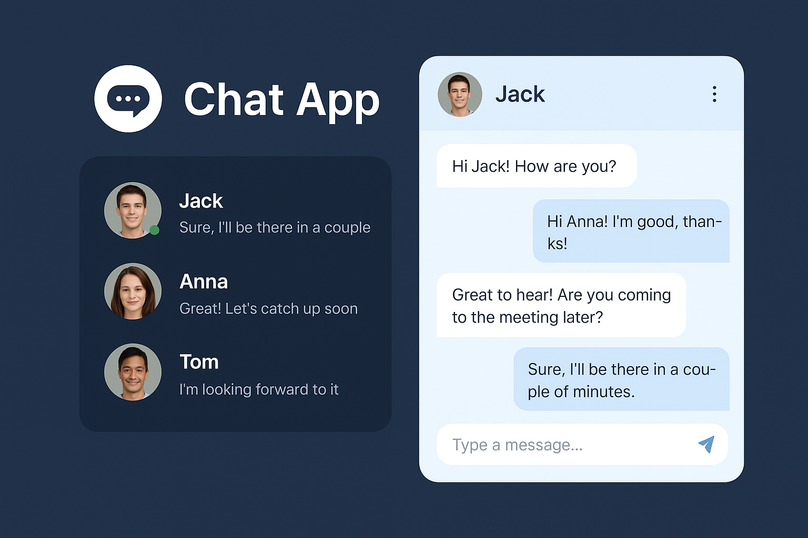
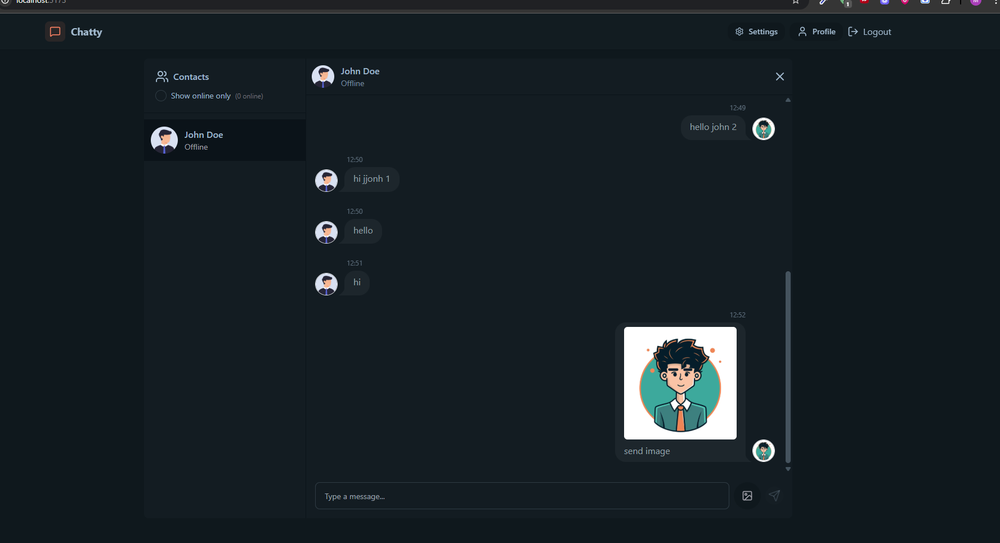

# Chat App

A full-stack real-time chat application that allows users to sign up, log in, and chat with each other. The app features authentication, user profiles, and a modern UI built with React, Tailwind CSS, and DaisyUI. The backend is powered by Node.js, Express, and MongoDB.

---

## Live Demo

[Live URL](https://chat-app-frontend-d63jvk1ha-affan840s-projects.vercel.app)

**Thumbnail:**



---

## Preview



---

## Features
- User authentication (sign up, login, logout)
- Real-time messaging
- User profiles and avatars
- Responsive and modern UI
- Protected routes and secure API

## Technologies Used

### Frontend
- React
- Vite
- Tailwind CSS
- DaisyUI
- Axios

### Backend
- Node.js
- Express.js
- MongoDB (with Mongoose)
- Cloudinary (for image uploads)
- JWT (JSON Web Tokens) for authentication

---

## Project Structure

```
backend/
  src/
    controllers/
    lib/
    middleware/
    models/
    routes/
frontend/
  src/
    components/
    constants/
    lib/
    pages/
    store/
```

---

## Setup Instructions

### Prerequisites
- Node.js (v16 or above)
- npm or yarn
- MongoDB instance (local or cloud)

### 1. Clone the repository
```sh
git clone https://github.com/Affan840/Chat-App.git
cd Chat-App
```

### 2. Setup Backend
```sh
cd backend
npm install
# Create a .env file and add your environment variables (see below)
npm start
```

### 3. Setup Frontend
```sh
cd frontend
npm install
npm run dev
```

### 4. Open the App
- Frontend: http://localhost:5173
- Backend API: http://localhost:5001

---

## Environment Variables

### Backend (`backend/.env`)
```
MONGODB_URI=your_mongodb_connection_string
PORT=5001
NODE_ENV=development
JWT_SECRET=your_jwt_secret
CLOUDINARY_CLOUD_NAME=your_cloudinary_cloud_name
CLOUDINARY_API_KEY=your_cloudinary_api_key
CLOUDINARY_API_SECRET=your_cloudinary_api_secret
FRONTEND_URL=http://localhost:5173
```

### Frontend (`frontend/.env`)
```
VITE_API_URL=http://localhost:5001
```

---

## License
MIT
